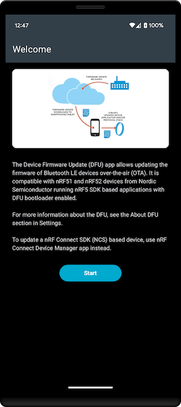
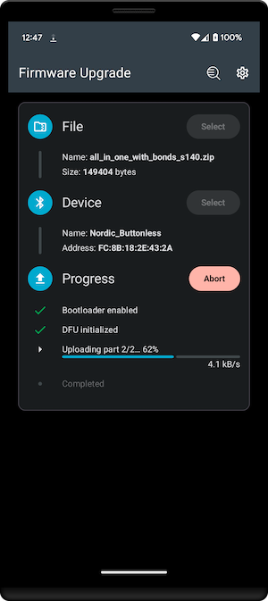
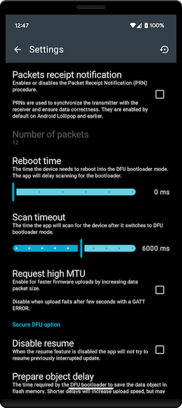

[  ](https://search.maven.org/artifact/no.nordicsemi.android/dfu)

# Device Firmware Update

Update nRF5 SDK firmware using Bluetooth LE.

This repository contains the source code of the [DFU library](#library) (*lib_dfu* module) and nRF Device Firmware Update app.

The DFU is design to update the firmware of nRF51 or nRF52 Series SoCs having an
* **nRF5 SDK Secure Bootloader** (v12.0.0 or newer) or
* **nRF5 SDK Legacy Bootloader** (v4.3.0-11.0.0).

***It can't be used to update firmware developed with the nRF Connect SDK, then the
[nRF Connect Device Manager](https://github.com/NordicSemiconductor/Android-nRF-Connect-Device-Manager) mobile app must be used.***

## Application

<a href='https://play.google.com/store/apps/details?id=no.nordicsemi.android.dfu&pcampaignid=pcampaignidMKT-Other-global-all-co-prtnr-py-PartBadge-Mar2515-1'></a>

nRF Device Firmware Update is a mobile app for updating nRF5 SDK firmware using Bluetooth Low Energy as a transport.

  

### Supported files

The firmware should be in *.zip* file format, prepared using [nRF Util](https://github.com/NordicSemiconductor/pc-nrfutil).
The firmware can be selected from the local storage on your Android or downloaded from the cloud using a deep-link.

### Deep links

Application opens links with the provided format for both http and https.
Clicking a link automatically opens the app. The downloaded will be saved in the *Download* folder on the phone. Downloaded file is displayed in the app and ready to use.

Link format: ```https://www.nordicsemi.com/dfu/?file=link_to_file```

> Note: Keep in mind to replace '&' with '%26' in the `link_to_file`.

# Library

The *lib_dfu* module contains the source code of the DFU library for Android.

The DFU library is available on Maven Central repository. Add it to your project by
adding the following dependency:

```Groovy
implementation 'no.nordicsemi.android:dfu:2.2.2'
```

Latest version targeting API lower than 31 is 1.11.1.

For projects not migrated to Android Jetpack, use version 1.8.1.

> Note: Those versions are not maintained anymore. All new features and bug fixes will be released on
the latest version only.

#### Proguard / R8

If you use proguard/R8, add the following line to your proguard rules (although this should be added
automatically):
```-keep class no.nordicsemi.android.dfu.** { *; }```

### Required permissions

#### Android 4.3 - 11

To communicate with Bluetooth LE devices on Android version 4.3 until 11 two permissions were
required: **BLUETOOTH** and **BLUETOOTH_ADMIN**. It is enough to put them in the *AndroidManifest.xml*
file. If your app targets API 31 or newer set `android:maxSdkVersion="30"` as on API 31 they were
replaced by **BLUETOOTH_CONNECT** and **BLUETOOTH_SCAN** runtime permissions (see below).

#### Android 6 - 11

If your device is using the Nordic Buttonless Service for switching from app mode to
DFU bootloader mode, this library will handle switching automatically. In case your bootloader is
configured to advertise with incremented MAC address (that is you use Secure DFU and the device
is not bonded) this library will need to scan for the new `BluetoothDevice`. In Android 6-11,
**location permission** is required and has to be granted in runtime before DFU is started.

Starting from Android 8.1.0, all scans done without a scan filter whilst the screen is turned off
will not return any scan results.

>Note: "ACCESS_BACKGROUND_LOCATION" permission would also be required to trigger a successful DFU
whilst the device screen is turned off, mainly to receive the scan results when scanning and
connecting to the peripheral in bootloader mode while the device screen is turned off.

#### Android 12+

Starting from Android 12 location permission is not needed, instead **BLUETOOTH_CONNECT** is required.
When your device is using buttonless service and changes MAC address, it also requires
**BLUETOOTH_SCAN** permission to be granted. This permission can be used with *neverForLocation* flag.
Read more in [Bluetooth permissions](https://developer.android.com/guide/topics/connectivity/bluetooth/permissions).

### Retrying

Starting from version 1.9.0 the library is able to retry a DFU update in case of an unwanted
disconnection. However, to maintain backward compatibility, this feature is by default disabled.
Call `initiator.setNumberOfRetries(int)` to set how many attempts the service should perform.
Secure DFU will be resumed after it has been interrupted from the point it stopped, while the
Legacy DFU will start again.

# Device Firmware Update (DFU)

The nRF5x Series chips are flash-based SoCs, and as such they represent the most flexible solution available.
A key feature of the nRF5x Series and their associated software architecture and S-Series SoftDevices
is the possibility for Over-The-Air Device Firmware Upgrade (OTA-DFU). See Figure 1.
OTA-DFU allows firmware upgrades to be issued and downloaded to products in the field via the cloud
and so enables OEMs to fix bugs and introduce new features to products that are already out on the market.
This brings added security and flexibility to product development when using the nRF5x Series SoCs.


This repository contains a tested library for Android 4.3+ platform which may be used to perform
Device Firmware Update on the nRF5x device using a phone or a tablet.

DFU library has been designed to make it very easy to include these devices into your application.
It is compatible with all Bootloader/DFU versions.

[](http://youtu.be/LdY2m_bZTgE)

## Documentation

See the [documentation](documentation) for more information.

## Requirements

The library is compatible with nRF51 and nRF52 devices with S-Series Soft Device and the
DFU Bootloader flashed on.

## DFU History

### Legacy DFU

* **SDK 4.3.0** - First version of DFU over Bluetooth Smart. DFU supports Application update.
* **SDK 6.1.0** - DFU Bootloader supports Soft Device and Bootloader update. As the updated
                  Bootloader may be dependent on the new Soft Device, those two may be sent and
                  installed together.
    - Buttonless update support for non-bonded devices.
* **SDK 7.0.0** - The extended init packet is required. The init packet contains additional
                  validation information: device type and revision, application version, compatible
                  Soft Devices and the firmware CRC.
* **SDK 8.0.0** - The bond information may be preserved after an application update.
                  The new application, when first started, will send the Service Change indication
                  to the phone to refresh the services.
    - Buttonless update support for bonded devices
    - sharing the LTK between an app and the bootloader.

### Secure DFU

* **SDK 12.0.0** - New Secure DFU has been released. Buttonless service is experimental.
* **SDK 13.0.0** - Buttonless DFU (still experimental) uses different UUIDs. No bond sharing
                   supported. Bootloader will use address +1.
* **SDK 14.0.0** - Buttonless DFU is no longer experimental. A new UUID (0004) added for bonded
                   only devices (previous one (0003) is for non-bonded only).
* **SDK 15.0.0** - Support for higher MTUs added.

This library is fully backwards compatible and supports both the new and legacy DFU.
The experimental buttonless DFU service from SDK 12 is supported since version 1.1.0.
Due to the fact, that this experimental service from SDK 12 is not safe, you have to call
[starter.setUnsafeExperimentalButtonlessServiceInSecureDfuEnabled(true)](https://github.com/NordicSemiconductor/Android-DFU-Library/blob/release/dfu/src/main/java/no/nordicsemi/android/dfu/DfuServiceInitiator.java#L376)
to enable it. Read the method documentation for details. It is recommended to use the Buttonless
service from SDK 13 (for non-bonded devices, or 14 for bonded).
Both are supported since DFU Library 1.3.0.

Check platform folders for mode details about compatibility for each library.

## Related libraries

### iOS version

iOS version of the same library can be found at [IOS-DFU-Library](https://github.com/NordicSemiconductor/IOS-DFU-Library).

### React Native

A library for both iOS and Android that is based on this library is available for React Native: 
[react-native-nordic-dfu](https://github.com/Pilloxa/react-native-nordic-dfu) 

### Flutter

A library for both iOS and Android that is based on this library is available for Flutter: 
[flutter-nordic-dfu](https://github.com/fengqiangboy/flutter-nordic-dfu) 

### Xamarin

Simple binding library for Android is available on nuget:
[Laerdal.Dfu.Android](https://www.nuget.org/packages/Laerdal.Dfu.Android/)

## Resources

- [Legacy DFU Introduction](http://infocenter.nordicsemi.com/topic/com.nordic.infocenter.sdk5.v11.0.0/examples_ble_dfu.html?cp=6_0_0_4_3_1 "BLE Bootloader/DFU")
- [Secure DFU Introduction](https://infocenter.nordicsemi.com/topic/sdk_nrf5_v17.1.0/lib_bootloader_modules.html?cp=8_1_3_5 "BLE Secure DFU Bootloader")
- [nRF51 Development Kit (DK)](https://www.nordicsemi.com/Software-and-tools/Development-Kits/nRF51-DK "nRF51 DK") (compatible with Arduino Uno Revision 3)
- [nRF52 Development Kit (DK)](https://www.nordicsemi.com/Software-and-tools/Development-Kits/nRF52-DK "nRF52 DK") (compatible with Arduino Uno Revision 3)
- [nRF52840 Development Kit (DK)](https://www.nordicsemi.com/Software-and-tools/Development-Kits/nRF52840-DK "nRF52840 DK") (compatible with Arduino Uno Revision 3)
